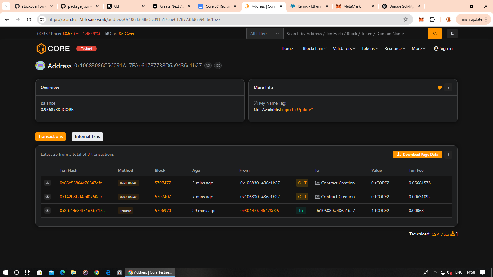

# Expense Splitting / Bill-Splitting Contract
  
---

## Project Title

Expense Splitting / Bill-Splitting Contract

## Project Description

This Solidity project implements a smart contract (`ExpenseSplitter`) that allows a predefined group of participants to record shared expenses and settle debts among themselves. Users can record an expense by specifying the total amount, participants involved, and share weights; the contract updates net balances accordingly. Participants can then settle outstanding debts by transferring Ether or ERC20 tokens through the contract.

Additionally, the constructor has been relaxed to allow deployment with a single participant address (mainly for testing or trivial scenarios). With only one participant, recording an expense among yourself is permitted but results in no net debt; however, the core logic remains fully functional when more participants are deployed.

## Project Vision

The vision is to provide a transparent, on-chain mechanism for small groups (friends, roommates, colleagues) to manage and settle shared expenses without relying on centralized apps or spreadsheets. By recording expenses and settlements on a blockchain, the system ensures immutability, transparency, and trust. Future integrations might include UI dashboards, automated reminders, and multi-currency support. Allowing single-participant deployment makes initial testing easier and sets a foundation for later dynamic participant additions.

## Key Features

* **Record Expenses**: Payers can log shared expenses, specifying involved participants and share weights. Net balances auto-update.
* **Supports Ether and ERC20**: Expenses and settlements can be in Ether or any ERC20 token.
* **Settle Debts**: Participants can settle owed amounts by transferring funds via the contract, which updates balances.
* **Net Balance Tracking**: View each participant's net position (positive = owed; negative = owes).
* **Single-Participant Deployment**: Constructor accepts an array of length ≥1, so you can deploy with just one address for testing or trivial use. (With one participant, expense recording yields zero net change.)
* **Events Emitted**: `ExpenseRecorded` and `ExpenseSettled` events for off-chain UI or analytics.
* **Simple Participant Management**: Participants defined at deployment; addresses must be unique and non-zero.

## How to Deploy

1. **Clone or Download** this repository to your local machine.
2. **Compile** the `ExpenseSplitter` contract in your environment (e.g., Remix, Hardhat, Foundry).
3. **Constructor Argument**: In the deployment UI or script, pass a JSON array of at least one address, for example:

   * Single participant (for testing):

     ```json
     ["0xYourAddressHere"]
     ```
   * Multiple participants:

     ```json
     ["0xAddress1", "0xAddress2", "..."]
     ```
4. **Deploy**: Confirm the transaction in your wallet.

   * If only one address is provided, the contract will deploy successfully and allow calls (expense recording will be trivial but permitted).
   * With multiple addresses, full expense-splitting flows apply.
5. **Interact**:

   * Call `getNetBalance(address)` → initial balance is 0.
   * Use `recordExpense(...)` and `settleExpense(...)`:

     * For Ether: send `msg.value == totalAmount` when calling `recordExpense` or `settleExpense`.
     * For ERC20: first `approve` the contract for the needed amount, then call the function with `token` parameter set to the ERC20 address.
   * With a single participant, you can still call:

     ```solidity
     recordExpense(totalAmount, address(0), [yourAddress], [1], 1);
     ```

     but net balance remains zero.

## Screenshots

### Deployment on Core Testnet



> *Screenshot Explanation*:
>
> * Shows the deployed contract creation transaction and wallet address on the Core testnet block explorer.
> * Confirms that the contract compiled and deployed successfully.

## Usage Example (Remix)

1. In **Remix IDE**, open `ExpenseSplitter.sol`.
2. Compile with Solidity version `^0.8.0`.
3. Under **Deploy & Run Transactions**:

   * Environment: e.g., “Injected Provider - MetaMask” (or “JavaScript VM” for local testing).
   * In `_participants`, type:

     ```json
     ["0xYourAddressHere"]  
     ```
   * Click **Deploy**. Confirm in MetaMask if using an injected provider.
4. Once deployed:

   * Expand the deployed contract in Remix’s sidebar.
   * Call `getNetBalance(yourAddress)` → should return `0`.
   * To test `recordExpense` with a single account:

     * Select `recordExpense`.
     * For Ether: set `totalAmount` equal to some wei (e.g., `1000000000000000000` for 1 ETH), `token` as `0x0000000000000000000000000000000000000000`, `involved` array as `["0xYourAddressHere"]`, `shares` array as `[1]`, `totalShares` as `1`, and send `msg.value` equal to `totalAmount`.
     * Observe that net balance remains zero after execution.
   * To test multi-participant flows, redeploy with:

     ```json
     ["0xAddress1", "0xAddress2"]
     ```

     then record an expense and settle between the two addresses.

## Future Scope

* **Dynamic Participant Management**

  * Add functions to allow the contract owner (or via consensus) to add/remove participants post-deployment (e.g., require existing netBalance to be zero before removal).
* **UI Integration**

  * Build a frontend (React/Vue/Angular) with Ethers.js or Web3.js to:

    * Display current participants and their net balances.
    * Provide forms for recording expenses (allow “equal split” or custom shares).
    * Handle ERC20 approvals for token-based expenses/settlements.
* **Automated Reminders**

  * Integrate with off-chain services (bots, backend scripts) that watch for outstanding negative balances and send notifications (e.g., email, chat).
* **Advanced Splitting Logic**

  * Support percentage-based splits or fixed-amount splits.
  * Handle rounding/remainder: decide how to distribute any leftover wei or smallest token units (e.g., payer covers the remainder or distribute among first N participants).
  * Integrate price oracles to support multi-currency expenses (convert different tokens to a stable reference for balance accounting).
* **Group Expense Reports**

  * Off-chain analytics: index events (`ExpenseRecorded`, `ExpenseSettled`) to generate summaries, charts, monthly/weekly reports, CSV/Excel exports.
* **Security Enhancements**

  * Refactor `settleExpense` and similar functions to follow checks-effects-interactions strictly (update internal state before external calls) or add a ReentrancyGuard.
  * Perform formal verification or thorough audits, especially for ERC20 edge cases (e.g., non-standard tokens).
* **Gas Optimization**

  * For larger groups, consider off-chain aggregation of expense details and only commit net balance changes on-chain.
  * Batch multiple expense records or settlements in one transaction if possible.
* **Multi-Group Support**

  * Extend the contract to manage multiple independent groups in one deployment, each with its own participant list and balances, identified by a group ID.
* **Integration with Stablecoins / DEX**

  * Allow automatic token swaps when settling debts, ensuring participants can pay in different tokens but settle in a common stable asset.
* **Testing & Auditing**

  * Write comprehensive unit and integration tests (Hardhat or Foundry), covering:

    * Single-participant flows (constructor, trivial recordExpense).
    * Multi-participant flows (balanced splits, uneven splits, rounding).
    * Settlement edge cases (over-settlement attempts, zero amounts).
  * Use property-based testing to verify invariants (e.g., sum of all net balances remains zero after any valid operation).
* **Frontend & UX**

  * Ensure the UI clearly indicates trivial behavior when only one participant is deployed, and guides users through multi-participant operations (e.g., prompting for allowances for ERC20, warning about gas costs for large arrays).

## Repository Structure

```
Expense-Splitting-Bill-Splitting-Contract/
├── contracts/
│   └── Project.sol            # or ExpenseSplitter.sol
├── images/
│   ├── deployment_core_testnet.png
│   ├── remix_deploy_ui.png
│   └── remix_interaction.png
├── README.md
└── tests/                     # Optional: Hardhat or Foundry test scripts
```

* **contracts/**: Contains the Solidity source (`ExpenseSplitter.sol` / `Project.sol`).
* **images/**: Store screenshots and diagrams referenced in README.
* **README.md**: This documentation.
